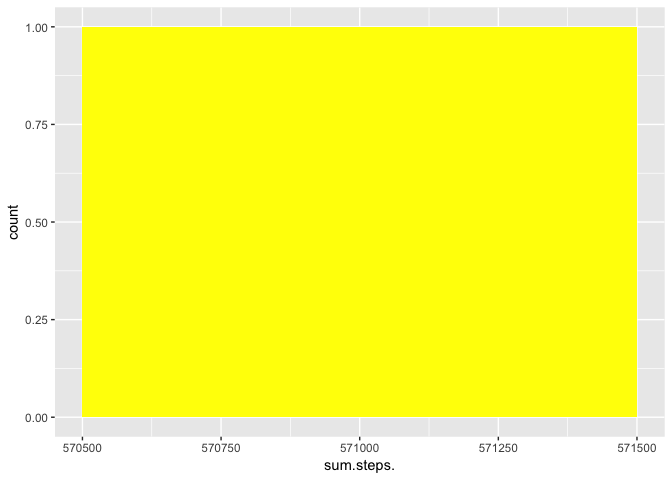
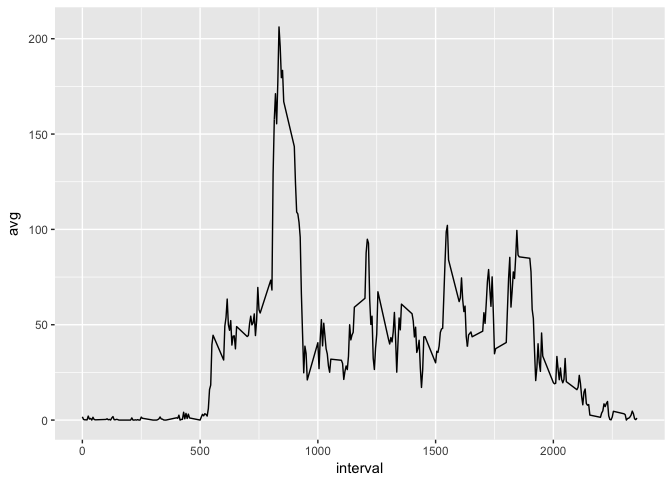
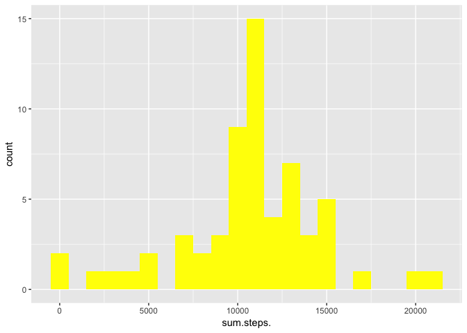
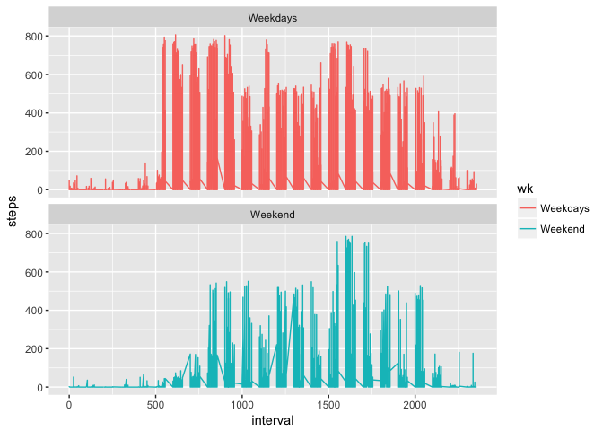

## Loading and preprocessing the data

```r
  library('tidyverse')
```

```
## Loading tidyverse: ggplot2
## Loading tidyverse: tibble
## Loading tidyverse: tidyr
## Loading tidyverse: readr
## Loading tidyverse: purrr
## Loading tidyverse: dplyr
```

```
## Conflicts with tidy packages ----------------------------------------------
```

```
## filter(): dplyr, stats
## lag():    dplyr, stats
```

```r
  library('ggplot2')
  library('plyr')
```

```
## -------------------------------------------------------------------------
```

```
## You have loaded plyr after dplyr - this is likely to cause problems.
## If you need functions from both plyr and dplyr, please load plyr first, then dplyr:
## library(plyr); library(dplyr)
```

```
## -------------------------------------------------------------------------
```

```
## 
## Attaching package: 'plyr'
```

```
## The following objects are masked from 'package:dplyr':
## 
##     arrange, count, desc, failwith, id, mutate, rename, summarise,
##     summarize
```

```
## The following object is masked from 'package:purrr':
## 
##     compact
```

```r
  library('dplyr')

  setwd('/Users/kassim/Documents/Coursera/c5w2/RepData_PeerAssessment1')
  download.file('https://d396qusza40orc.cloudfront.net/repdata%2Fdata%2Factivity.zip', 'data.zip')
  unzip('data.zip')
  
  activity = read_csv('activity.csv', col_types = 'dDd')
```


## What is mean total number of steps taken per day?

```r
  tmp <- activity[complete.cases(activity),] %>% group_by(date) %>% summarise(sum(steps)) 
  colnames(tmp) <- make.names(colnames(tmp))
```

#total number steps taken per day

```r
  activity[complete.cases(activity),] %>% group_by(date) %>% summarise(sum(steps)) 
```

```
##   sum(steps)
## 1     570608
```
#Total steps taken each day

```r
 ggplot(tmp, aes(sum.steps.)) + geom_histogram(fill = "yellow", binwidth = 1000)
```

<!-- -->
#Mean and Median steps per day

```r
  summary(tmp)
```

```
##    sum.steps.    
##  Min.   :570608  
##  1st Qu.:570608  
##  Median :570608  
##  Mean   :570608  
##  3rd Qu.:570608  
##  Max.   :570608
```


## What is the average daily activity pattern?
#Make a time series plot (i.e. 𝚝𝚢𝚙𝚎 = "𝚕") of the 5-minute interval (x-axis) and the average number of steps taken, averaged across all days (y-axis)

```r
  tmp2 <- ddply(activity[complete.cases(activity),], .(interval), summarize, avg = mean(steps))
  ggplot2::ggplot(tmp2, ggplot2::aes(x=interval,y=avg), xlab = "Intervalo") + ggplot2::geom_line()
```

<!-- -->

#Which 5-minute interval, on average across all the days in the dataset, contains the maximum number of steps?

```r
tmp2[tmp2$avg==max(tmp2$avg),1]
```

```
## [1] 835
```


## Imputing missing values
#Calculate and report the total number of missing values in the dataset (i.e. the total number of rows with 𝙽𝙰s)

```r
activity %>% filter(is.na(steps)) %>% dplyr::summarise(qtd = n())
```

```
## # A tibble: 1 x 1
##     qtd
##   <int>
## 1  2304
```
#Devise a strategy for filling in all of the missing values in the dataset. The strategy does not need to be sophisticated. For example, you could use the mean/median for that day, or the mean for that 5-minute interval, etc.

```r
dtna <- activity[is.na(activity$steps),]
tmp3 <- activity %>% filter(!is.na(steps)) %>% group_by (interval) %>% dplyr::summarise(steps = mean(steps)) 

dtna$steps = NULL
act2 <- left_join(dtna, tmp3, by='interval')
```

#Create a new dataset that is equal to the original dataset but with the missing data filled in.

```r
fixeddt <- rbind(activity[!is.na(activity$steps), ], act2)
```

#Make a histogram of the total number of steps taken each day and Calculate and report the mean and median total number of steps taken per day. Do these values differ from the estimates from the first part of the assignment? What is the impact of imputing missing data on the estimates of the total daily number of steps?

```r
library('ggplot2')
tmp4 <- fixeddt %>% group_by(date) %>% dplyr::summarise(sum(steps)) 
colnames(tmp4) <- make.names(colnames(tmp4))
ggplot(tmp4, aes(sum.steps.)) + geom_histogram(fill = "yellow", binwidth = 1000)
```

<!-- -->

```r
fixeddt %>% group_by(date) %>% dplyr::summarise(mean(steps)) 
```

```
## Warning in format.POSIXlt(as.POSIXlt(x), ...): unknown timezone 'zone/tz/
## 2017c.1.0/zoneinfo/America/Sao_Paulo'
```

```
## # A tibble: 61 x 2
##          date `mean(steps)`
##        <date>         <dbl>
##  1 2012-10-01      37.38260
##  2 2012-10-02       0.43750
##  3 2012-10-03      39.41667
##  4 2012-10-04      42.06944
##  5 2012-10-05      46.15972
##  6 2012-10-06      53.54167
##  7 2012-10-07      38.24653
##  8 2012-10-08      37.38260
##  9 2012-10-09      44.48264
## 10 2012-10-10      34.37500
## # ... with 51 more rows
```

```r
nrow(activity[!is.na(activity$steps),])
```

```
## [1] 15264
```

```r
nrow(fixeddt)
```

```
## [1] 17568
```
the original dataset has 15.264 rows with and and the new data has 17.568 rows with value


## Are there differences in activity patterns between weekdays and weekends?
#Create a new factor variable in the dataset with two levels – “weekday” and “weekend” indicating whether a given date is a weekday or weekend day.

```r
  fixeddt$wk <- if_else(weekdays(fixeddt$date, abbreviate = T) == c('Sáb', 'Dom'), 'Weekend', 'Weekdays')
```

#Make a panel plot containing a time series plot (i.e. 𝚝𝚢𝚙𝚎 = "𝚕") of the 5-minute interval (x-axis) and the average number of steps taken, averaged across all weekday days or weekend days (y-axis). See the README file in the GitHub repository to see an example of what this plot should look like using simulated data.


```r
  ggplot2::ggplot(fixeddt, ggplot2::aes(x=interval,y=steps, color=wk ), xlab = "Intervalo") + ggplot2::geom_line() + facet_wrap(~wk , ncol = 1, nrow=2)
```

<!-- -->

